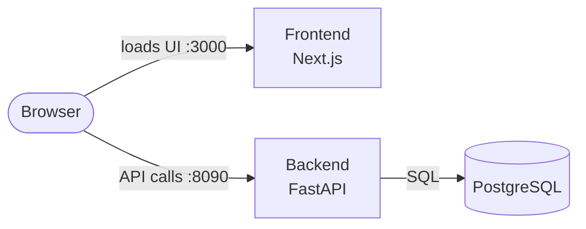
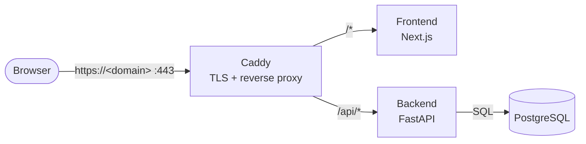

# TodoApp

A full-stack To-Do application — FastAPI backend, Next.js frontend, JWT authentication, and PostgreSQL, fully containerized with Docker Compose.

## Table of Contents

- [Features](#features)
- [Tech Stack](#tech-stack)
- [Architecture](#architecture)
- [Project Structure](#project-structure)
- [Prerequisites](#prerequisites)
- [Getting Started](#getting-started)
- [Configuration](#configuration)
- [Production Deployment](#production-deployment)
- [API Endpoints](#api-endpoints)
- [Testing](#testing)

## Features

- Sign up and sign in with JWT-based authentication
- Automatic sign-out on token expiry (proactive timer + reactive 401 handling)
- Full to-do CRUD (create, list, get, update, delete), scoped per user
- Users only ever see and modify their own to-dos
- Interactive API docs (Swagger UI) out of the box

## Tech Stack

**Backend**
- Python 3.12, FastAPI
- PostgreSQL with SQLAlchemy (async) ORM
- Alembic for database migrations
- PyJWT + bcrypt for authentication
- pytest, pytest-asyncio, httpx for testing
- uv for dependency management

**Frontend**
- Next.js (App Router) with TypeScript
- Tailwind CSS

**Infrastructure**
- Docker Compose — database + migrations + backend (8090) + frontend (3000)
- Multi-stage Docker images (Next.js standalone output; slim final images)
- GitHub Actions CI — builds and pushes images to GitHub Container Registry (ghcr.io)
- Production: Caddy reverse proxy with automatic HTTPS (Let's Encrypt)

## Architecture

The system runs as three containers. The browser loads the UI from the frontend,
then calls the backend API directly; the backend owns all data access.



The backend follows a layered architecture (SOLID). Each layer only calls the one below it (`route → service → repository → model/DB`).

```
Presentation  → api/ (routes)   + schemas/ (Pydantic request/response)
Business      → services/       (rules & orchestration)
Data          → repositories/   (DB access) + models/ (ORM tables)
Cross-cutting → core/           (config, security/JWT, exceptions)
Plumbing      → db/             (engine, session)
```


## Project Structure

```
TodoApp/
├── backend/            FastAPI application
│   ├── app/
│   │   ├── api/        routes + dependency wiring
│   │   ├── core/       config, security, exceptions
│   │   ├── db/         engine & session
│   │   ├── models/     SQLAlchemy models
│   │   ├── repositories/
│   │   ├── schemas/    Pydantic schemas
│   │   └── services/   business logic
│   ├── alembic/        migrations
│   ├── tests/          pytest suite
│   └── Dockerfile
├── frontend/           Next.js application
│   ├── src/
│   │   ├── app/        pages (signin, signup, todos)
│   │   ├── components/ Nav, TodoItem, icons
│   │   ├── context/    AuthContext
│   │   └── lib/        API client, auth helpers, types
│   └── Dockerfile
├── .github/workflows/  CI: build & push images to ghcr.io
├── docker-compose.yml       local development (builds locally)
├── docker-compose.prod.yml  production (pulls CI-built images)
├── Caddyfile           production reverse proxy / HTTPS config
└── Info.md             requirements & decisions log
```

## Prerequisites

- [Git](https://git-scm.com/)
- [Docker](https://www.docker.com/) (with Docker Compose v2)

That's all — Python, Node, and PostgreSQL run inside the containers.

## Getting Started

```bash
git clone <repo-url>
cd TodoApp
docker compose up --build
```

This starts PostgreSQL, runs the database migrations, and serves both apps:

| Service | URL |
|---|---|
| Frontend (UI) | http://localhost:3000 |
| Backend API | http://localhost:8090 |
| API docs (Swagger) | http://localhost:8090/docs |

Open http://localhost:3000, sign up, and start adding todos.

To stop the stack: `docker compose down` (add `-v` to also wipe the database).

## Configuration

Configuration is provided via environment variables. Docker Compose sets sensible
defaults, so no setup is required to run locally; override any of them in the
environment for a real deployment.

| Variable | Description | Default |
|---|---|---|
| `POSTGRES_USER` | Database user | `todo_user` |
| `POSTGRES_PASSWORD` | Database password | **Set your own** |
| `POSTGRES_DB` | Database name | `todo_db` |
| `JWT_SECRET_KEY` | Secret used to sign JWTs | **Required — set your own; no safe default** |
| `JWT_ALGORITHM` | JWT signing algorithm | `HS256` |
| `ACCESS_TOKEN_EXPIRE_MINUTES` | Access-token lifetime | `30` |
| `CORS_ORIGINS` | Allowed frontend origins (comma-separated) | `http://localhost:3000` |

> For local convenience, `docker-compose.yml` includes dev-only defaults for the
> secrets above. **Always override `JWT_SECRET_KEY` (and the DB password) for any
> real deployment** — generate a strong secret, e.g.
> `python -c "import secrets; print(secrets.token_hex(32))"`.

## Production Deployment

Production runs on a single VM (e.g. EC2) with `docker-compose.prod.yml`. Unlike
local dev, nothing is built on the server: GitHub Actions
([`.github/workflows/build-images.yml`](.github/workflows/build-images.yml))
builds both images on every push to `main` and publishes them to ghcr.io; the
server only pulls. [Caddy](https://caddyserver.com/) is the sole publicly
exposed container — it terminates HTTPS (automatic Let's Encrypt certificates)
and routes by path, so frontend and API share one domain and one certificate.



**One-time setup**

1. Point a DNS record at the server's static IP; open ports 80 + 443.
2. In the GitHub repo, set the `DOMAIN` Actions variable (Settings → Secrets
   and variables → Actions → Variables) — CI bakes
   `https://<DOMAIN>/api` into the frontend bundle as `NEXT_PUBLIC_API_URL`.
3. On the server, clone the repo and create a `.env` next to
   `docker-compose.prod.yml` with `DOMAIN`, `JWT_SECRET_KEY`, and
   `POSTGRES_PASSWORD` (compose refuses to start if any is missing).

**Deploy / update**

```bash
git pull                                          # compose/Caddyfile changes, if any
docker compose -f docker-compose.prod.yml pull    # fetch CI-built images
docker compose -f docker-compose.prod.yml up -d   # swap containers
docker image prune -af                            # reclaim old image layers
```

Database data and TLS certificates persist in named volumes (`pgdata`,
`caddy_data`) across deploys and reboots; all services restart automatically
(`restart: unless-stopped`). To roll back, pin a service's `image:` to a
previous commit-SHA tag from ghcr.io and re-run `up -d`.

## API Endpoints

| Method | Path | Auth | Description |
|---|---|---|---|
| `POST` | `/auth/signup` | – | Create an account |
| `POST` | `/auth/signin` | – | Sign in, returns a JWT |
| `GET` | `/auth/me` | ✓ | Current user |
| `GET` | `/todos` | ✓ | List the user's todos |
| `POST` | `/todos` | ✓ | Create a todo |
| `GET` | `/todos/{id}` | ✓ | Get one todo |
| `PATCH` | `/todos/{id}` | ✓ | Update a todo (partial) |
| `DELETE` | `/todos/{id}` | ✓ | Delete a todo |

Interactive docs are available at `/docs` (Swagger UI) when the server is running.

## Testing

The backend has an integration test suite covering authentication and the full
todo CRUD. Run it from the `backend/` directory:

```bash
cd backend
uv sync
uv run pytest
```
